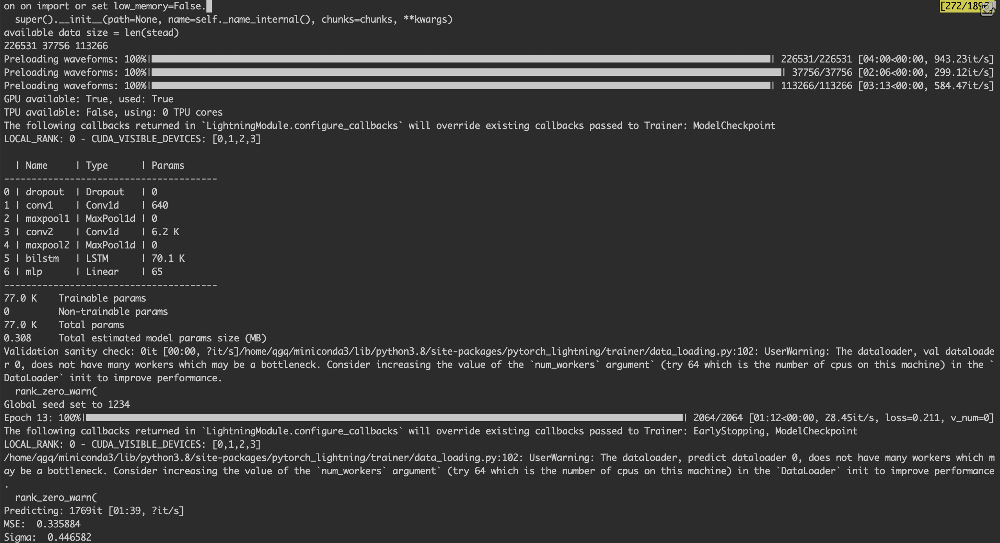

### Deep learning project seed
Use this seed to start new deep learning / ML projects.

#### Goals  
An pytorch implementation of earthquake center magnitude estimator
https://github.com/smousavi05/MagNet

### Magnet
https://agupubs.onlinelibrary.wiley.com/doi/full/10.1029/2019GL085976

## How to run   
First, install dependencies   
```bash
python project/lit_magnet.py --config project/configs/stead.json --reshuffle true
```

### Citation   
```
Mousavi, S. M., & Beroza, G. C. (2019). A Machine‐Learning Approach for Earthquake Magnitude Estimation. Geophysical Research Letters.
```   

### Result
- Mse:  0.335884
- Std:  0.446582
